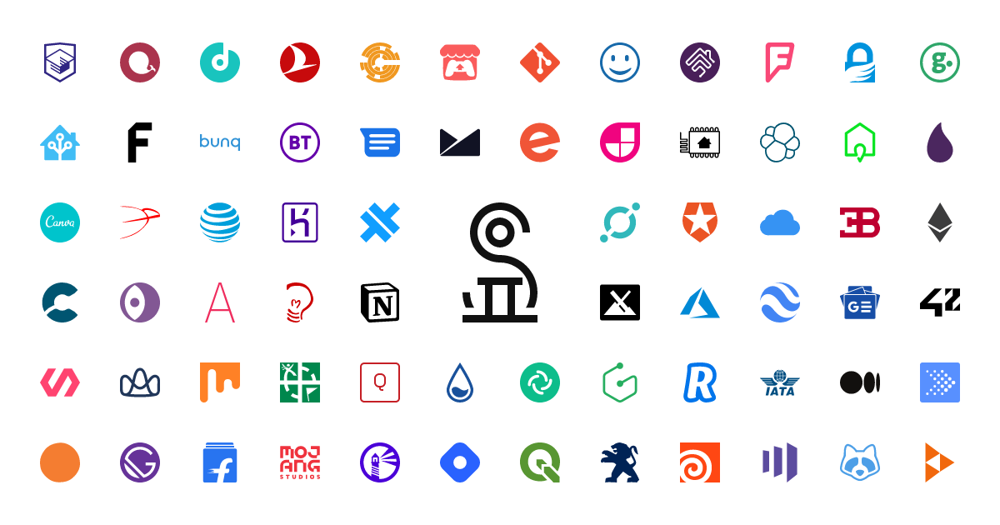

<p align="center">
<a href="https://simpleicons.org/">

</a>
<h3 align="center">Simple Icons: <em>Flutter</em></h3>
<p align="center">
A Flutter package for Simple Icons, which provides over 1500 Free SVG icons for popular brands. <br> See them all on one page at <a href="https://simpleicons.org">SimpleIcons.org</a>.<br> Contributions, corrections & requests can be made on <a href="https://github.com/simple-icons/simple-icons/issues/new/choose">GitHub</a>.</p>
</p>


## Naming
Naming conventions have been changed for better readability and consistancy with all other flutter icon packs.

Additionally: 
- special characters ➔ written in words
- names starting with a number ➔ the letter 'n' placed in front
- dart reserved words ➔ 'icon' placed in the back

To convert from the [catalog](https://simpleicons.org/) simply follow this method

```
.NET ➔ dotNet

Apple Pay ➔ applepay

1Password ➔ n1password

abstract ➔ abstracticon
```

## 

## Installation

In the `dependencies:` section of your `pubspec.yaml` add the following line:

```yaml
dependencies:
  simple_icons: <latest_version>
```

## Usage

```dart
import "package:simple_icons/simple_icons.dart";

class MyAwesomeWidget extends StatelessWidget {
  Widget build(BuildContext context) {
    return IconButton(
      icon: Icon(SimpleIcons.github),
      onPressed: () {
          print("awesome platform to share code and ideas");
      }
    );
  }
}
```

## Example
View the flutter app in the `example` directory

## Screenshots
<br>


